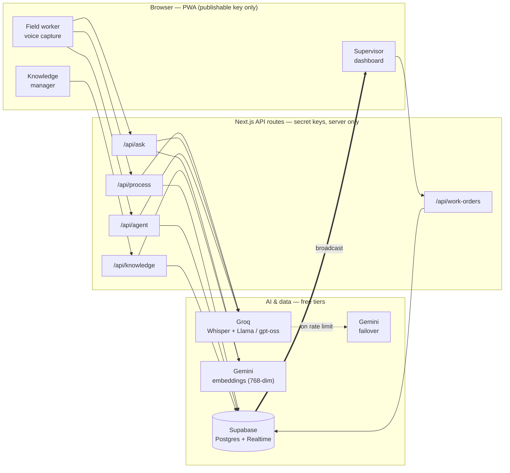
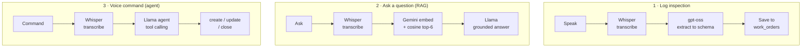
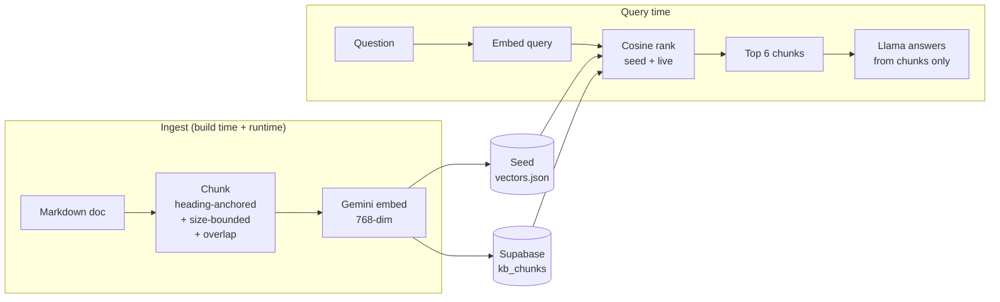
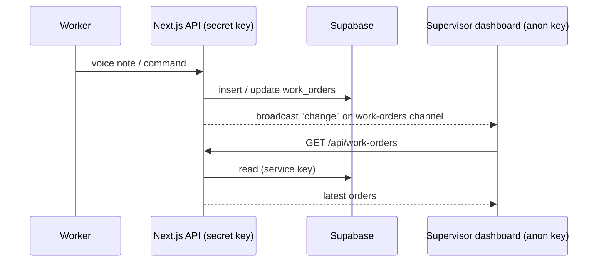

# Voice Field Assistant

A hands-free AI assistant for field technicians. Out in the plant room a technician usually has gloves on, noise around, and no spare hand for a keyboard — so this app makes **voice the primary interface**. Speak, and it transcribes, turns the note into a structured work order, answers questions from the equipment manuals, runs work-order commands, and keeps a live record for supervisors. Everything runs on **free services and free models** — no paid APIs.

> Built for **Assignment 11 — Voice-First AI Assistant for Field Workers**.

---

## What it does

Six capabilities, each mapped to a part of the app:

| # | Capability | Where | How |
|---|------------|-------|-----|
| 1 | **Domain-aware voice capture** | Field worker | Records audio in the browser and transcribes it with Groq Whisper, primed with HVAC vocabulary so codes like `AHU-12` and `F-203` survive. |
| 2 | **Structured extraction** | `/api/process` | Turns a spoken note into a validated work order (Zod schema, field by field). |
| 3 | **Voice query answering** | `/api/ask` | Answers spoken questions from the knowledge base in ~1.5s, grounded in retrieved chunks. |
| 4 | **Agentic work orders** | `/api/agent` | Create / update / close work orders by voice through a tool-calling agent. |
| 5 | **Offline capability** | Field worker | Notes queue in the browser (IndexedDB) and sync automatically the moment you reconnect. |
| 6 | **Supervisor dashboard** | `/dashboard` | Live work-order feed, severity chart, **voice-note transcripts**, and exception alerts. |

Plus a **Knowledge** page to manage the RAG knowledge base (add manuals by typing, uploading, or speaking — and see them embedded), a **Help** page, and a **Sample data** page for a reproducible demo.

---

## How it fits together



The browser only records audio and renders results. **Every API key and model call lives on the server**, so nothing sensitive ships to the client.

---

## The three voice pipelines



Answers and confirmations are read back aloud through the browser's Web Speech API.

---

## Knowledge base & RAG

The assistant only answers from the knowledge base, so retrieval quality is everything. Open `/knowledge` to see the whole base: every chunk is **numbered**, shown with its character/token count and an **embedding fingerprint**, and plotted on a **2D map where lines connect each chunk to its nearest neighbours by meaning**. You can grow it three ways — type Markdown, upload a `.md` file, or **speak** it — and a live retrieval tester shows which chunks answer a question and how strongly.



### Chunking strategy

Defined once in `lib/kb/chunk.ts` and used both at build time (seed manuals) and at runtime (anything you add), so the base is always chunked the same way.

| Parameter | Value | Reason |
|-----------|-------|--------|
| Boundary | Markdown headings | Each chunk covers one coherent topic |
| Title prefix | document `# Title` | An isolated section still knows which manual it belongs to |
| Max size | ~900 chars (~220 tokens) | Keeps each chunk to a focused, single-topic passage |
| Overlap | ~150 chars | An answer that straddles a boundary is never lost |
| Min size | 80 chars | Tiny fragments merge into a neighbour instead of becoming noise |

**Why not fixed-size chunks?** A blind every-N-characters split would cut a torque table or a numbered procedure in half, and a single embedding would then blur two unrelated ideas — retrieval returns a fragment that reads as noise. Heading-anchored chunks keep each vector about *one thing* (higher precision), the size cap keeps each chunk inside the model's window (sharper meaning), the overlap preserves continuity, and the title prefix preserves global context.

- **Embedding model:** `gemini-embedding-001` (Google, free tier) over plain HTTP — **768-dim**, with retrieval task types (`RETRIEVAL_DOCUMENT` for chunks, `RETRIEVAL_QUERY` for questions). No native runtime, so it runs on any serverless host.
- **Retrieval:** cosine similarity over all chunks (seed + added); the top six become the only context, and the model is told to say it doesn't know rather than guess.
- **Persistence:** seed chunks ship in `lib/kb/vectors.json` (rebuild with `npm run build:kb`); knowledge you add at runtime is stored in the Supabase `kb_chunks` table, with an in-memory fallback if Supabase is unavailable.

---

## Real-time, the secure way

The dashboard updates the instant a work order changes — using **Supabase Broadcast**, not table-change streaming. The server emits a small "changed" event after each write; the browser listens and refetches through the server. The **database stays fully locked behind row-level security — the browser never reads it directly**, and only the server (secret key) touches data. A slow poll backs the channel up.



This works on localhost and on Vercel with **no extra SQL and no public table access**.

---

## Reliability & fallbacks

Designed so a live demo never dead-ends:

- **Rate limits** — every model call (extraction, agent, answers) retries on the Gemini failover when Groq returns 429 or a server error (`lib/llm.ts`).
- **Degraded mode** — without a language model, extraction falls back to keyword rules and answers return the closest chunk; if embeddings are unavailable, a keyword search backs up retrieval so questions still return relevant passages. Speech-to-text returns a clear 503 telling you to type instead.
- **Health & banner** — `/api/health` reports which capabilities are live, and a banner appears automatically in a degraded mode.
- **Microphone & network errors** — blocked/missing mics and failed requests show a clear inline message instead of failing silently.

---

## Security model

- The browser only ever holds the **publishable** Supabase key (safe by design) and listens for a content-free "something changed" signal.
- `GROQ_API_KEY`, `GOOGLE_GENERATIVE_AI_API_KEY`, and the Supabase **secret key** are read **only** in server API routes.
- Row-level security is enabled on every table; all reads/writes go through the server with the secret key. No data is exposed to anonymous users.

---

## Tech stack (all free)

| Layer | Tools |
|-------|-------|
| App | Next.js 16 (App Router) · React 19 · TypeScript · Tailwind v4 |
| Speech-to-text | Groq Whisper (`whisper-large-v3-turbo`) |
| Language models | Groq `gpt-oss-120b` / `llama-3.3-70b` / `llama-3.1-8b` · Gemini `2.5-flash-lite` failover · Vercel AI SDK |
| Embeddings | Google `gemini-embedding-001`, 768-dim (free tier, HTTP) |
| Data & realtime | Supabase Postgres + Broadcast |
| Offline | Dexie.js (IndexedDB) |
| Speech-out | Browser Web Speech API |
| Hosting | Vercel (single deploy) |

---

## Project structure

```text
app/
  page.tsx              field worker console
  dashboard/            supervisor dashboard (realtime)
  knowledge/            RAG knowledge-base manager
  docs/ help/ sample-data/
  api/                  process · ask · agent · transcribe · knowledge · work-orders · health
components/
  ui/                   OMIUM-style primitives
  kb/                   embedding map · add-knowledge · retrieval tester · fingerprint
lib/
  stt · extract · agent · rag · llm · realtime · work-orders · schema · db · sync
  kb/                   chunk (strategy) · store (vectors) · projection (2D PCA)
knowledge/              seed knowledge-base documents
scripts/build-kb.ts     embeds the seed knowledge base
supabase/schema.sql     tables + row-level security
```

---

## Run it locally

```bash
# 1. install
npm install

# 2. configure keys
cp .env.example .env.local
#    GROQ_API_KEY                          from https://console.groq.com
#    NEXT_PUBLIC_SUPABASE_URL              from Supabase project settings
#    NEXT_PUBLIC_SUPABASE_PUBLISHABLE_KEY  from Supabase project settings
#    SUPABASE_SECRET_KEY                   from Supabase project settings
#    GOOGLE_GENERATIVE_AI_API_KEY          required (embeddings + LLM failover)

# 3. create tables (paste supabase/schema.sql into the Supabase SQL editor)

# 4. build the seed knowledge base
npm run build:kb

# 5. start
npm run dev
```

Open <http://localhost:3000> (worker) and <http://localhost:3000/dashboard> (supervisor). Use a Chromium browser (Chrome/Edge) for the best microphone and speech support.

---

## Deploy to Vercel

1. Push the repo to GitHub and **Import Project** in Vercel.
2. Add the same environment variables (from `.env.local`) in **Project → Settings → Environment Variables**.
3. Run `supabase/schema.sql` once in the Supabase SQL editor (creates tables + enables row-level security).
4. Deploy. The AI routes set `runtime = "nodejs"` and `maxDuration = 60`. Embeddings and language models are plain HTTP calls (no native binaries), so everything runs on Vercel's serverless functions with no extra configuration.
5. (Recommended) Add a scheduled ping (Vercel Cron or a GitHub Action) every few days so the free Supabase project doesn't pause after a week idle.

### Environment variables

| Variable | Where it's used | Required |
|----------|-----------------|----------|
| `GROQ_API_KEY` | server — STT + LLMs | Yes |
| `NEXT_PUBLIC_SUPABASE_URL` | client + server | Yes |
| `NEXT_PUBLIC_SUPABASE_PUBLISHABLE_KEY` | client (realtime) | Yes |
| `SUPABASE_SECRET_KEY` | server only — DB reads/writes | Yes |
| `GOOGLE_GENERATIVE_AI_API_KEY` | server — embeddings (RAG) + Gemini failover | Yes |

---

## Notes

- Voice clips are short, so they upload directly within Vercel's request limit.
- The demo domain is commercial HVAC maintenance; add or replace documents on the Knowledge page, or swap the files in `knowledge/` and re-run `npm run build:kb`.
- Mic capture, spoken replies, and the offline demo are browser features — show them in Chrome/Edge during a presentation.
